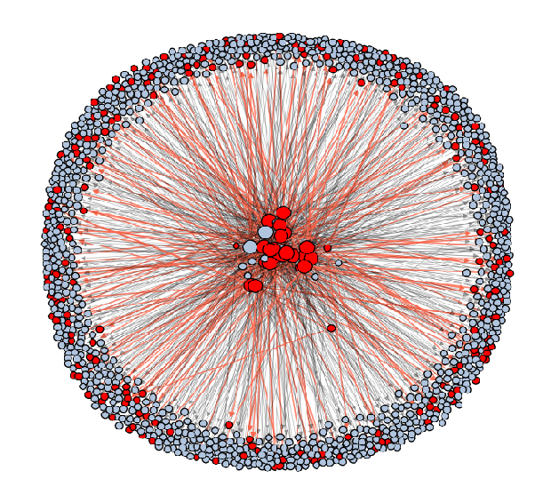

<div id="top"></div>

<!-- [![Contributors][contributors-shield]][contributors-url] -->
<!-- [![MIT License][license-shield]][license-url] -->

<div align="center">
<h1 align="center">Investigation of the scientific literature</h1>
<h2 align="center">Assignment 6 - programming 3</h2>
  <a href="https://pubmed.ncbi.nlm.nih.gov/">
    
  </a>
  <a href="https://spark.apache.org/docs/latest/api/python/index.html">
    
  </a>
   <a href="https://networkx.org/">
    
  </a>
</div>
<br>

* * *
# About this project
This is the [final assignment](https://bioinf.nl/~martijn/master/programming3/assignment6.html) of a series of in total 6 assignment that were assigned for the course programming 3 which is all about working with big data.

The goal of this project is to investigate the scientific literature. This will be done by parsing and analyzing the entire PubMed literature database in XML format. Graph theory and parallel processing need to be applied in order to process and analyze this data. 

Furthermore, we wish to answer these specific questions:
1. How large a group of co-authors does the average publication have?
2. Do authors mostly publish using always the same group of authors?
3. Do authors mainly reference papers with other authors with whom they've co-authored papers (including themselves)?
4. What is the distribution in time for citations of papers in general, and for papers with the highest number of citations? Do they differ?
5. Is there a correlation between citations and the number of keywords that papers share? I.e. papers which share the same subject cite each other more often.
6. For the most-cited papers (define your own cutoff), is the correlation in shared keywords between them and the papers that cite them different from (5) ?
7. Do papers mostly reference other papers that were written in the same language?
8. What is the most cited paper?
9. Who is the most cited author?
10. Which author(s) has/have the highest h-inex?

* * *
## Getting Started
This project is divided into three different sections:
1. Process the data using multiprocessing
2. Creating graphs
3. Analyze data using pyspark and networkx

### 1. Processing the data
<details open>
  <summary>info processing</summary>

The PubMed data (XML format) was processed in parallel using the built-in python library [multiprocessing](https://docs.python.org/3/library/multiprocessing.html). The [pubmed_parser](src/pubmed_parser/) and [parallel_computing](src/parallel_computing/) directories contain the code for parsing the data and setting up a server and client for processing the data in parallel. 

To [main.py](src/main.py) script can be used to process the data and to store the rsults in json format. It requires the user to specify a few arguments:

<details>
  <summary>main.py arguments</summary>

```bash
  -h, --help          show help message
  -d, --data_dir      Location of the PubMed data (XML)
  -o, --out-dir       The output directory to store the results - 
                      required if server mode is selected
  -p, --port_number   The port number
  --host              Host used
  -n                  Number of CPU used per client
  -s                  Server mode, can not be used together with -c
  -c                  Client mode, can not be used together with -s
```

</details>
<br>

> NOTE: to reproduce this help message run: python src/main.py -h

In order to process the data a network([star topology](https://www.computerhope.com/jargon/s/startopo.htm)) needs to be set up where one computer acts as the server that divides the work and one or multiple computers act as client that take work from the server and process the data. 

Therefore, the [main.py](src/main.py) needs to be ran atleast twice(once as a server and once as a client). To specify wheter the script will act as a server or client can be indicated with the `-s` and `-c` flags respectively.

Server:
```bash
python src/main.py -d /data/dataprocessing/NCBI/PubMed/ -p 4235 --host assemblix2019 -s -o /commons/dsls/dsph/2022/parsed_articles/
```

Client: 
```bash
python src/main.py -p 4235 --host assemblix2019 -c -n 2
```
</details>

### 2. Creating graphs
<details open>
  <summary>info creating graph</summary>
The next step is to save the processed data into a graph so that it can be properly analyzed. The scripts associated with creating the graphs are stored in the [graph](src/graph/) directory.

First, the data needed to create the graph must be produced: adjacency list, node attribute info and a text file containing nodes without any references. This can be done using the [create_graph_data.py](src/graph/create_graph_data.py) script, this script again works with a star topology network so a server and at least one client need to be used to process the data. 

> NOTE: this script uses the same arguments as the main.py script, except that the `-d` argument now needs the parsed pubmed data in json format produced by the main.py script.

Server:
```bash
python src/graph/create_graph_data.py -d /commons/dsls/dsph/2022/parsed_articles -p 4235 --host assemblix2019 -s -o /commons/dsls/dsph/2022/graph_data/
```

Client: 
```bash
python src/main.py -p 4235 --host assemblix2019 -c -n 2
```

Next, the [creat_graph.py](src/graph/create_graph.py) script is ran to create and save a networkx graph. It can create a graph that only contains nodes and edges as well as a graph that contain nodes, edges and node attributes. 

<details>
  <summary>create_graph.py arguments</summary>

```bash
  -h, --help          show help message
  --adj_list          File containing an adjaceny list (CSV file)
  --attributes        Pickle file containing a dictionary with node
                      attributes
  --nodes_data        File containing a list of source nodes to use.
  -o, --output        The output directory to store the results
```

</details>
<br>

> NOTE: This script might take a while to finish running due to the sheer size of the data. Also, loading in the node attributes from the pickle failed due to the size of it. Adviced to only use this script to produce a graph without node attributes. To create a graph with node attributes please use the script that produces a subgraph, explained below.

#### 2.1 Creating a subgraph
Finally, there is alo an option to take a random subset of the data to produce a graph that is easier to work with. This can be achieved by using the [create_subset_graph.py](src/graph/create_subset_graph.py) script, which takes an argument `-n` to specify the number of articles to use to create the graph.

> NOTE: If ~5000 articles are specified a graph of aroung 160k nods will be produced. This is because all the 5000 articles also contain references (or out going edges/nodes) and these will also be included to create the graph.

<details>
  <summary>create_subset_graph.py arguments</summary>

```bash
  -h, --help          show help message
  -d, --data_dir      Location of the parsed PubMed data in json format
  -n                  Number of rows to take from the entire data frame.
  -o, --output        Location of output directory
```

</details>
</details>

### 3. Analyze data
<details open>
  <summary>info analyze data</summary>
The final step is to analyze and visualize the data using pyspark and networkx. The data can be analyzed using the [analyze_data.py](src/analyze_data.py) script which uses the parsed PubMed data (json format) and the networkx graph to answer the questions, it also stores the results in a CSV file. 

```bash
python src/analyze_data.py -d /commons/dsls/dsph/2022/parsed_articles/ -g /commons/dsls/dsph/2022/graph_data/citation_graph.pkl
```

<details>
  <summary>analyze_data.py arguments</summary>

```bash
  -h, --help          show help message
  -d, --data_dir      Location of the parsed PubMed data in json format
  -g, --graph         The citaion graph stored inside a pickle file.
```

</details>
<br>

Finally, the [plot_results.ipynb](plot_results.ipynb) notebook was used to visualize the results. An example of one of the visualization can be seen in the [result](#results) section. 
</details>

* * *
## Results

This graph shows how often authors cite other papers that include authors with who they have worked with in the past. For all the results please see the [figures/](figures/) directory or the [report](report.pdf).

<div align='center'>
  
</div>

* * *
## Installation
The python dependencies can be found inside the [install/requirements.txt](install/requirements.txt) file. The propper dependencies can be installed using conda, pip or via the [makefile](makefile).

<details>
  <summary>Installing via conda</summary>

How to install conda on your system can be found [here](https://docs.anaconda.com/anaconda/install/index.html).

To create a new environment which contains all the required packages plus the right version run the following code:

```bash
  conda env create -f install/environment.yml
```
</details>

<details>
  <summary>Installing via pip</summary>


To install all the required packages plus the right version run the following code:

```bash
  pip install -r install/requirements.txt
```
</details>

<details>
  <summary>Installing via makefile</summary>

To create a new virutal environment which contains all the required packages plus the right version run the following code:

```bash
  make venv
```

This will create a virtual environment called `pubmed` which is stored inside the `~/.venv` directory.
</details>

* * *
## Requirements

| Component                         | version |
| --------------------------------- | :-----: |
| [python](https://www.python.org/) | `> 3.9` |

* * *
## Author

Stijn Arends - contact me via [mail](mailto:s.arends@st.hanze.nl).

* * *
## License
This project contains an [MIT license](../LICENSE)

<p align='right'>(<a href=#top>back to top</a>)</p>

<!-- MARKDOWN LINKS & IMAGES -->
<!-- https://www.markdownguide.org/basic-syntax/#reference-style-links -->
[contributors-shield]: https://img.shields.io/github/contributors/stijn-arends/programming3.svg?style=for-the-badge
[contributors-url]: https://github.com/stijn-arends/programming3/graphs/contributors
[license-shield]: https://img.shields.io/github/license/stijn-arends/programming3.svg?style=for-the-badge
[license-url]: https://github.com/stijn-arends/programming3/blob/master/LICENSE.md
