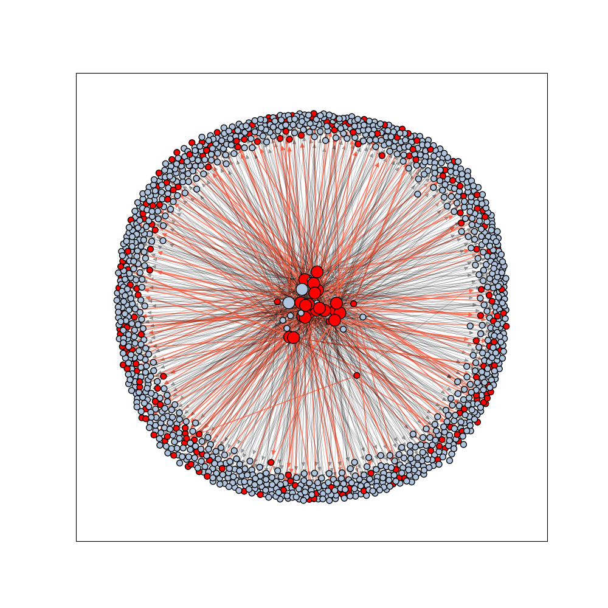

<div id="top"></div>

<!-- [![Contributors][contributors-shield]][contributors-url] -->
<!-- [![MIT License][license-shield]][license-url] -->

<div align="center">
<h1 align="center">Assignment 6</h1>
<h2 align="center">Investigation of the scientific literature</h2>
  <a href="https://pubmed.ncbi.nlm.nih.gov/">
    
  </a>
  <a href="https://spark.apache.org/docs/latest/api/python/index.html">
    
  </a>
   <a href="https://networkx.org/">
    
  </a>
</div>
<br>

* * *
# About this project
Tell something about this project

* * *
## Getting Started

Server:
```bash
python src/main.py -d /data/dataprocessing/NCBI/PubMed/ -p 4235 --host assemblix2019 -s -o /commons/dsls/dsph/2022/test/
```

Client: 
```bash
python src/main.py -p 4235 --host assemblix2019 -c -n 2
```

* * *
## Results



* * *
## Installation


* * *
## Requirements

* * *
## Author

Stijn Arends - contact me via [mail](mailto:s.arends@st.hanze.nl).

* * *
## License
This project contains an [MIT license](../LICENSE)

<!-- MARKDOWN LINKS & IMAGES -->
<!-- https://www.markdownguide.org/basic-syntax/#reference-style-links -->
[contributors-shield]: https://img.shields.io/github/contributors/stijn-arends/programming3.svg?style=for-the-badge
[contributors-url]: https://github.com/stijn-arends/programming3/graphs/contributors
[license-shield]: https://img.shields.io/github/license/stijn-arends/programming3.svg?style=for-the-badge
[license-url]: https://github.com/stijn-arends/programming3/blob/master/LICENSE.md
